# UML Class Diagram - Document Editor

## Overview

This document provides a comprehensive UML class diagram showing all design patterns and their relationships in the Document Editor application.

## Class Diagram (PlantUML Format)

```plantuml
@startuml DocumentEditor

' ==================== COMPOSITE PATTERN ====================
package "model (Composite Pattern)" {
    interface DocumentElement {
        + accept(visitor: Visitor): void
        + render(): String
        + add(element: DocumentElement): void
        + remove(element: DocumentElement): void
        + getChildren(): List<DocumentElement>
        + isComposite(): boolean
        + toSerializable(): Object
    }
    
    class Document {
        - elements: List<DocumentElement>
        - observers: List<DocumentObserver>
        - title: String
        - modified: boolean
        + Document(title: String)
        + accept(visitor: Visitor): void
        + render(): String
        + add(element: DocumentElement): void
        + remove(element: DocumentElement): void
        + attach(observer: DocumentObserver): void
        + detach(observer: DocumentObserver): void
        - notifyObservers(): void
    }
    
    class Paragraph {
        - text: String
        + Paragraph(text: String)
        + accept(visitor: Visitor): void
        + render(): String
        + getText(): String
    }
    
    class Headline {
        - text: String
        - level: int
        + Headline(text: String, level: int)
        + accept(visitor: Visitor): void
        + render(): String
        + getText(): String
        + getLevel(): int
    }
    
    class Image {
        - filename: String
        - width: int
        - height: int
        + Image(filename: String, width: int, height: int)
        + accept(visitor: Visitor): void
        + render(): String
        + getFilename(): String
        + getWidth(): int
        + getHeight(): int
    }
    
    DocumentElement <|.. Document
    DocumentElement <|.. Paragraph
    DocumentElement <|.. Headline
    DocumentElement <|.. Image
    Document o--> "0..*" DocumentElement
}

' ==================== FACTORY PATTERN ====================
package "factory (Factory Method Pattern)" {
    abstract class DocumentElementFactory {
        + {abstract} createElement(): DocumentElement
        + {static} getFactory(type: String): DocumentElementFactory
    }
    
    class ParagraphFactory {
        - text: String
        + setText(text: String): ParagraphFactory
        + createElement(): DocumentElement
    }
    
    class HeadlineFactory {
        - text: String
        - level: int
        + setText(text: String): HeadlineFactory
        + setLevel(level: int): HeadlineFactory
        + createElement(): DocumentElement
    }
    
    class ImageFactory {
        - filename: String
        - width: int
        - height: int
        + setFilename(filename: String): ImageFactory
        + setWidth(width: int): ImageFactory
        + setHeight(height: int): ImageFactory
        + createElement(): DocumentElement
    }
    
    DocumentElementFactory <|-- ParagraphFactory
    DocumentElementFactory <|-- HeadlineFactory
    DocumentElementFactory <|-- ImageFactory
    ParagraphFactory ..> Paragraph : creates
    HeadlineFactory ..> Headline : creates
    ImageFactory ..> Image : creates
}

' ==================== VISITOR PATTERN ====================
package "visitor (Visitor Pattern)" {
    interface Visitor {
        + visitDocument(document: Document): void
        + visitParagraph(paragraph: Paragraph): void
        + visitHeadline(headline: Headline): void
        + visitImage(image: Image): void
    }
    
    class WordCountVisitor {
        - wordCount: int
        - strategy: WordCountStrategy
        + WordCountVisitor(strategy: WordCountStrategy)
        + visitDocument(document: Document): void
        + visitParagraph(paragraph: Paragraph): void
        + visitHeadline(headline: Headline): void
        + visitImage(image: Image): void
        + getWordCount(): int
    }
    
    class HTMLExportVisitor {
        - html: StringBuilder
        + visitDocument(document: Document): void
        + visitParagraph(paragraph: Paragraph): void
        + visitHeadline(headline: Headline): void
        + visitImage(image: Image): void
        + getHTML(): String
    }
    
    class RenderVisitor {
        - output: StringBuilder
        + visitDocument(document: Document): void
        + visitParagraph(paragraph: Paragraph): void
        + visitHeadline(headline: Headline): void
        + visitImage(image: Image): void
        + getOutput(): String
    }
    
    Visitor <|.. WordCountVisitor
    Visitor <|.. HTMLExportVisitor
    Visitor <|.. RenderVisitor
    DocumentElement ..> Visitor : accepts
}

' ==================== STRATEGY PATTERN ====================
package "strategy (Strategy Pattern)" {
    interface WordCountStrategy {
        + countWords(text: String): int
    }
    
    class BasicWordCountStrategy {
        + countWords(text: String): int
    }
    
    WordCountStrategy <|.. BasicWordCountStrategy
    WordCountVisitor --> WordCountStrategy : uses
}

' ==================== COMMAND PATTERN ====================
package "command (Command Pattern)" {
    interface Command {
        + execute(): void
        + undo(): void
        + getDescription(): String
    }
    
    class CommandHistory {
        - undoStack: Stack<Command>
        - redoStack: Stack<Command>
        - logger: Logger
        + executeCommand(command: Command): void
        + undo(): boolean
        + redo(): boolean
        + canUndo(): boolean
        + canRedo(): boolean
    }
    
    class AddElementCommand {
        - document: Document
        - element: DocumentElement
        + AddElementCommand(document: Document, element: DocumentElement)
        + execute(): void
        + undo(): void
    }
    
    class RemoveElementCommand {
        - document: Document
        - element: DocumentElement
        - index: int
        + RemoveElementCommand(document: Document, element: DocumentElement)
        + execute(): void
        + undo(): void
    }
    
    Command <|.. AddElementCommand
    Command <|.. RemoveElementCommand
    CommandHistory o--> "0..*" Command
    AddElementCommand --> Document
    RemoveElementCommand --> Document
}

' ==================== ADAPTER PATTERN ====================
package "adapter (Adapter Pattern)" {
    interface DocumentPersistence {
        + save(document: Document, filename: String): boolean
        + load(filename: String): Document
    }
    
    class DocumentPersistenceAdapter {
        - jsonLibrary: JSONSerializationLibrary
        - logger: Logger
        + save(document: Document, filename: String): boolean
        + load(filename: String): Document
    }
    
    class JSONSerializationLibrary {
        + stringify(obj: Object): String
        + parse(json: String): Map<String, Object>
    }
    
    DocumentPersistence <|.. DocumentPersistenceAdapter
    DocumentPersistenceAdapter --> JSONSerializationLibrary : adapts
}

' ==================== DECORATOR PATTERN ====================
package "exporter (Decorator Pattern)" {
    interface Exporter {
        + export(document: Document, filename: String): void
        + getContent(document: Document): String
    }
    
    class BasicHTMLExporter {
        - logger: Logger
        + export(document: Document, filename: String): void
        + getContent(document: Document): String
    }
    
    abstract class ExporterDecorator {
        # wrappedExporter: Exporter
        + ExporterDecorator(exporter: Exporter)
        + export(document: Document, filename: String): void
        + getContent(document: Document): String
    }
    
    class CSSDecorator {
        + CSSDecorator(exporter: Exporter)
        + getContent(document: Document): String
    }
    
    class MarkdownDecorator {
        + MarkdownDecorator(exporter: Exporter)
        + getContent(document: Document): String
    }
    
    class PlainTextDecorator {
        + PlainTextDecorator(exporter: Exporter)
        + getContent(document: Document): String
    }
    
    Exporter <|.. BasicHTMLExporter
    Exporter <|.. ExporterDecorator
    ExporterDecorator <|-- CSSDecorator
    ExporterDecorator <|-- MarkdownDecorator
    ExporterDecorator <|-- PlainTextDecorator
    ExporterDecorator o--> Exporter : wraps
    BasicHTMLExporter ..> HTMLExportVisitor : uses
}

' ==================== SINGLETON PATTERN ====================
package "util (Singleton Pattern)" {
    class Logger {
        - {static} instance: Logger
        - {static} lock: Object
        - fileWriter: PrintWriter
        - formatter: DateTimeFormatter
        - Logger()
        + {static} getInstance(): Logger
        + log(message: String): void
        + error(message: String): void
        + error(message: String, e: Exception): void
        + close(): void
    }
}

' ==================== OBSERVER PATTERN ====================
package "observer (Observer Pattern)" {
    interface DocumentObserver {
        + update(document: Document): void
    }
    
    class ConsoleObserver {
        - logger: Logger
        + update(document: Document): void
    }
    
    DocumentObserver <|.. ConsoleObserver
    Document --> "0..*" DocumentObserver : notifies
    ConsoleObserver --> Logger : uses
}

' ==================== CLI ====================
package "cli" {
    class ConsoleInterface {
        - currentDocument: Document
        - commandHistory: CommandHistory
        - persistence: DocumentPersistence
        - logger: Logger
        - scanner: Scanner
        - observer: ConsoleObserver
        + run(): void
        - displayMenu(): void
        - createDocument(): void
        - addElement(): void
        - renderDocument(): void
        - performWordCount(): void
        - exportDocument(): void
        - undo(): void
        - redo(): void
        - saveDocument(): void
        - loadDocument(): void
    }
    
    ConsoleInterface --> Document
    ConsoleInterface --> CommandHistory
    ConsoleInterface --> DocumentPersistence
    ConsoleInterface --> Logger
    ConsoleInterface --> ConsoleObserver
    ConsoleInterface ..> DocumentElementFactory : uses
    ConsoleInterface ..> Exporter : uses
    ConsoleInterface ..> WordCountVisitor : uses
    ConsoleInterface ..> RenderVisitor : uses
}

' ==================== MAIN ====================
class Main {
    + {static} main(args: String[]): void
}

Main --> ConsoleInterface : creates

@enduml
```



## Pattern Relationships

### 1. Composite Pattern (model package)
- **Component**: `DocumentElement` - Common interface for all document parts
- **Composite**: `Document` - Contains and manages child elements
- **Leaf**: `Paragraph`, `Headline`, `Image` - Individual document elements

### 2. Factory Method Pattern (factory package)
- **Creator**: `DocumentElementFactory` - Abstract factory class
- **Concrete Creators**: `ParagraphFactory`, `HeadlineFactory`, `ImageFactory`
- **Products**: `Paragraph`, `Headline`, `Image` elements

### 3. Visitor Pattern (visitor package)
- **Visitor**: `Visitor` interface - Defines visit operations
- **Concrete Visitors**: `WordCountVisitor`, `HTMLExportVisitor`, `RenderVisitor`
- **Elements**: All `DocumentElement` implementations accept visitors

### 4. Command Pattern (command package)
- **Command**: `Command` interface
- **Concrete Commands**: `AddElementCommand`, `RemoveElementCommand`
- **Invoker**: `CommandHistory` - Manages command execution and undo/redo
- **Receiver**: `Document` - Target of commands

### 5. Strategy Pattern (strategy package)
- **Strategy**: `WordCountStrategy` interface
- **Concrete Strategy**: `BasicWordCountStrategy`
- **Context**: `WordCountVisitor` uses the strategy

### 6. Adapter Pattern (adapter package)
- **Target**: `DocumentPersistence` - Interface our app expects
- **Adapter**: `DocumentPersistenceAdapter` - Adapts the adaptee
- **Adaptee**: `JSONSerializationLibrary` - Third-party library

### 7. Decorator Pattern (exporter package)
- **Component**: `Exporter` interface
- **Concrete Component**: `BasicHTMLExporter`
- **Decorator**: `ExporterDecorator` abstract class
- **Concrete Decorators**: `CSSDecorator`, `MarkdownDecorator`, `PlainTextDecorator`

### 8. Singleton Pattern (util package)
- **Singleton**: `Logger` - Single global instance with thread-safe access

### 9. Observer Pattern (observer package)
- **Subject**: `Document` - Maintains list of observers and notifies them
- **Observer**: `DocumentObserver` interface
- **Concrete Observer**: `ConsoleObserver` - Responds to document changes

## Key Interactions

1. **CLI creates Document** → Composite pattern in action
2. **CLI uses Factories** → Creates elements without `new` keyword
3. **Document accepts Visitors** → Operations traverse structure
4. **CLI executes Commands** → Enables undo/redo
5. **WordCountVisitor uses Strategy** → Pluggable algorithm
6. **CLI uses Adapter** → Persistence through adapted interface
7. **CLI decorates Exporters** → Dynamic format selection
8. **All classes use Logger** → Singleton for global access
9. **Document notifies Observers** → Real-time updates

## Diagram Visualization

To view this diagram:

1. **Online**: Copy the PlantUML code to http://www.plantuml.com/plantuml/
2. **VS Code**: Install PlantUML extension
3. **IntelliJ**: Built-in PlantUML support
4. **Command Line**: 
   ```bash
   plantuml UML_CLASS_DIAGRAM.md
   ```

## Notes

- All patterns integrate seamlessly through well-defined interfaces
- Each pattern solves a specific problem without interfering with others
- The architecture is extensible and follows SOLID principles
- Clear separation of concerns across all packages
