# Document Editor - UML Class Diagram

This document contains a comprehensive UML class diagram showing all design patterns and their relationships.

## Complete UML Class Diagram

```plantuml
@startuml Document Editor - Design Patterns

' Styling
skinparam classAttributeIconSize 0
skinparam class {
    BackgroundColor<<Singleton>> LightYellow
    BackgroundColor<<Factory>> LightGreen
    BackgroundColor<<Command>> LightBlue
    BackgroundColor<<Composite>> LightCoral
    BackgroundColor<<Visitor>> LightPink
    BackgroundColor<<Decorator>> LightCyan
    BackgroundColor<<Observer>> LightSalmon
    BackgroundColor<<Adapter>> LightGoldenRodYellow
    BackgroundColor<<Proxy>> Lavender
    BackgroundColor<<Strategy>> LightSteelBlue
}

' ==================== SINGLETON PATTERN ====================
package "Singleton Pattern" {
    class Logger <<Singleton>> {
        - {static} instance: Logger
        - {static} lock: Object
        - fileWriter: PrintWriter
        - formatter: DateTimeFormatter
        - Logger()
        + {static} getInstance(): Logger
        + log(message: String): void
        + error(message: String): void
        + error(message: String, e: Exception): void
        + close(): void
    }
}

' ==================== COMPOSITE PATTERN ====================
package "Composite Pattern" {
    interface DocumentElement <<Composite>> {
        + accept(visitor: Visitor): void
        + render(): String
        + add(element: DocumentElement): void
        + remove(element: DocumentElement): void
        + getChildren(): List<DocumentElement>
        + isComposite(): boolean
        + toSerializable(): Object
    }
    
    class Document <<Composite>> {
        - elements: List<DocumentElement>
        - observers: List<DocumentObserver>
        - title: String
        - modified: boolean
        + Document(title: String)
        + accept(visitor: Visitor): void
        + render(): String
        + add(element: DocumentElement): void
        + remove(element: DocumentElement): void
        + getChildren(): List<DocumentElement>
        + attach(observer: DocumentObserver): void
        + detach(observer: DocumentObserver): void
        - notifyObservers(): void
        + getTitle(): String
        + setTitle(title: String): void
        + isModified(): boolean
        + setModified(modified: boolean): void
        + getElementCount(): int
    }
    
    class Paragraph <<Composite>> {
        - text: String
        + Paragraph(text: String)
        + accept(visitor: Visitor): void
        + render(): String
        + getText(): String
        + setText(text: String): void
    }
    
    class Headline <<Composite>> {
        - text: String
        - level: int
        + Headline(text: String, level: int)
        + accept(visitor: Visitor): void
        + render(): String
        + getText(): String
        + getLevel(): int
    }
    
    class Image <<Composite>> {
        - filename: String
        - width: int
        - height: int
        + Image(filename: String, width: int, height: int)
        + accept(visitor: Visitor): void
        + render(): String
        + getFilename(): String
        + getWidth(): int
        + getHeight(): int
    }
}

DocumentElement <|.. Document
DocumentElement <|.. Paragraph
DocumentElement <|.. Headline
DocumentElement <|.. Image
Document o-- "0..*" DocumentElement : contains

' ==================== VISITOR PATTERN ====================
package "Visitor Pattern" {
    interface Visitor <<Visitor>> {
        + visitDocument(document: Document): void
        + visitParagraph(paragraph: Paragraph): void
        + visitHeadline(headline: Headline): void
        + visitImage(image: Image): void
    }
    
    class HTMLExportVisitor <<Visitor>> {
        - html: StringBuilder
        + HTMLExportVisitor()
        + visitDocument(document: Document): void
        + visitParagraph(paragraph: Paragraph): void
        + visitHeadline(headline: Headline): void
        + visitImage(image: Image): void
        + getHTML(): String
        - escapeHtml(text: String): String
    }
    
    class SimplePDFExportVisitor <<Visitor>> {
        - pdf: StringBuilder
        + SimplePDFExportVisitor()
        + visitDocument(document: Document): void
        + visitParagraph(paragraph: Paragraph): void
        + visitHeadline(headline: Headline): void
        + visitImage(image: Image): void
        + getPDF(): String
    }
    
    class WordCountVisitor <<Visitor>> {
        - totalWords: int
        - strategy: WordCountStrategy
        + WordCountVisitor(strategy: WordCountStrategy)
        + visitDocument(document: Document): void
        + visitParagraph(paragraph: Paragraph): void
        + visitHeadline(headline: Headline): void
        + visitImage(image: Image): void
        + getTotalWords(): int
    }
    
    class RenderVisitor <<Visitor>> {
        - output: StringBuilder
        + RenderVisitor()
        + visitDocument(document: Document): void
        + visitParagraph(paragraph: Paragraph): void
        + visitHeadline(headline: Headline): void
        + visitImage(image: Image): void
        + getOutput(): String
    }
}

Visitor <|.. HTMLExportVisitor
Visitor <|.. SimplePDFExportVisitor
Visitor <|.. WordCountVisitor
Visitor <|.. RenderVisitor
DocumentElement ..> Visitor : accepts

' ==================== COMMAND PATTERN ====================
package "Command Pattern" {
    interface Command <<Command>> {
        + execute(): void
        + undo(): void
        + getDescription(): String
    }
    
    class AddElementCommand <<Command>> {
        - document: Document
        - element: DocumentElement
        + AddElementCommand(document: Document, element: DocumentElement)
        + execute(): void
        + undo(): void
        + getDescription(): String
    }
    
    class RemoveElementCommand <<Command>> {
        - document: Document
        - element: DocumentElement
        + RemoveElementCommand(document: Document, element: DocumentElement)
        + execute(): void
        + undo(): void
        + getDescription(): String
    }
    
    class CommandHistory <<Command>> {
        - history: Stack<Command>
        - redoStack: Stack<Command>
        + CommandHistory()
        + execute(command: Command): void
        + undo(): void
        + redo(): void
        + canUndo(): boolean
        + canRedo(): boolean
        + clear(): void
        + getHistory(): List<Command>
    }
}

Command <|.. AddElementCommand
Command <|.. RemoveElementCommand
CommandHistory o-- "0..*" Command : manages
AddElementCommand --> Document : modifies
RemoveElementCommand --> Document : modifies

' ==================== FACTORY METHOD PATTERN ====================
package "Factory Method Pattern" {
    abstract class DocumentElementFactory <<Factory>> {
        + {abstract} createElement(): DocumentElement
        + {static} getFactory(type: String): DocumentElementFactory
    }
    
    class ParagraphFactory <<Factory>> {
        + createElement(): DocumentElement
    }
    
    class HeadlineFactory <<Factory>> {
        + createElement(): DocumentElement
    }
    
    class ImageFactory <<Factory>> {
        + createElement(): DocumentElement
    }
}

DocumentElementFactory <|-- ParagraphFactory
DocumentElementFactory <|-- HeadlineFactory
DocumentElementFactory <|-- ImageFactory
DocumentElementFactory ..> DocumentElement : creates
ParagraphFactory ..> Paragraph : creates
HeadlineFactory ..> Headline : creates
ImageFactory ..> Image : creates

' ==================== OBSERVER PATTERN ====================
package "Observer Pattern" {
    interface DocumentObserver <<Observer>> {
        + update(document: Document): void
    }
    
    class ConsoleObserver <<Observer>> {
        - logger: Logger
        + ConsoleObserver()
        + update(document: Document): void
    }
}

DocumentObserver <|.. ConsoleObserver
Document o-- "0..*" DocumentObserver : notifies
ConsoleObserver --> Logger : uses

' ==================== DECORATOR PATTERN ====================
package "Decorator Pattern" {
    interface Exporter <<Decorator>> {
        + export(document: Document, filename: String): void
        + getContent(document: Document): String
    }
    
    class BasicHTMLExporter <<Decorator>> {
        # logger: Logger
        + BasicHTMLExporter()
        + export(document: Document, filename: String): void
        + getContent(document: Document): String
    }
    
    abstract class ExporterDecorator <<Decorator>> {
        # wrappedExporter: Exporter
        + ExporterDecorator(exporter: Exporter)
        + export(document: Document, filename: String): void
        + getContent(document: Document): String
    }
    
    class CSSDecorator <<Decorator>> {
        + CSSDecorator(exporter: Exporter)
        + getContent(document: Document): String
        + export(document: Document, filename: String): void
        - getCSS(): String
    }
    
    class MarkdownDecorator <<Decorator>> {
        + MarkdownDecorator(exporter: Exporter)
        + getContent(document: Document): String
        + export(document: Document, filename: String): void
        - addMarkdownFormatting(html: String): String
    }
    
    class PDFDecorator <<Decorator>> {
        + PDFDecorator(exporter: Exporter)
        + getContent(document: Document): String
        + export(document: Document, filename: String): void
        - addPDFMetadata(content: String): String
    }
    
    class PlainTextDecorator <<Decorator>> {
        + PlainTextDecorator(exporter: Exporter)
        + getContent(document: Document): String
        + export(document: Document, filename: String): void
        - stripHTML(html: String): String
    }
}

Exporter <|.. BasicHTMLExporter
Exporter <|.. ExporterDecorator
ExporterDecorator <|-- CSSDecorator
ExporterDecorator <|-- MarkdownDecorator
ExporterDecorator <|-- PDFDecorator
ExporterDecorator <|-- PlainTextDecorator
ExporterDecorator o-- Exporter : wraps
BasicHTMLExporter --> HTMLExportVisitor : uses

' ==================== ADAPTER PATTERN ====================
package "Adapter Pattern" {
    interface DocumentPersistence <<Adapter>> {
        + save(document: Document, filename: String): boolean
        + load(filename: String): Document
    }
    
    class DocumentPersistenceAdapter <<Adapter>> {
        - jsonLibrary: JSONSerializationLibrary
        - logger: Logger
        + DocumentPersistenceAdapter()
        + save(document: Document, filename: String): boolean
        + load(filename: String): Document
        - parseDocument(json: String): Document
        - extractValue(json: String, key: String): String
    }
    
    class JSONSerializationLibrary <<Adapter>> {
        + JSONSerializationLibrary()
        + stringify(data: Object): String
        + parse(json: String): Object
    }
}

DocumentPersistence <|.. DocumentPersistenceAdapter
DocumentPersistenceAdapter --> JSONSerializationLibrary : adapts
DocumentPersistenceAdapter ..> Document : saves/loads

' ==================== PROXY PATTERN ====================
package "Proxy Pattern" {
    interface CloudStorageService <<Proxy>> {
        + uploadDocument(document: Document, filename: String): String
        + downloadDocument(fileId: String): Document
        + listDocuments(): List<String>
        + deleteDocument(fileId: String): boolean
        + getServiceName(): String
        + isAuthenticated(): boolean
    }
    
    class CloudStorageProxy <<Proxy>> {
        - realService: CloudStorageService
        - cache: Map<String, Document>
        - logger: Logger
        - initialized: boolean
        + CloudStorageProxy(realService: CloudStorageService)
        - ensureInitialized(): void
        + uploadDocument(document: Document, filename: String): String
        + downloadDocument(fileId: String): Document
        + listDocuments(): List<String>
        + deleteDocument(fileId: String): boolean
        + getServiceName(): String
        + isAuthenticated(): boolean
        + clearCache(): void
        + getCacheSize(): int
    }
    
    class MockCloudStorageAdapter <<Proxy>> {
        - storage: Map<String, Document>
        - authenticated: boolean
        - logger: Logger
        + MockCloudStorageAdapter()
        + uploadDocument(document: Document, filename: String): String
        + downloadDocument(fileId: String): Document
        + listDocuments(): List<String>
        + deleteDocument(fileId: String): boolean
        + getServiceName(): String
        + isAuthenticated(): boolean
    }
}

CloudStorageService <|.. CloudStorageProxy
CloudStorageService <|.. MockCloudStorageAdapter
CloudStorageProxy o-- CloudStorageService : wraps
CloudStorageProxy --> Logger : uses

' ==================== STRATEGY PATTERN ====================
package "Strategy Pattern" {
    interface WordCountStrategy <<Strategy>> {
        + countWords(text: String): int
    }
    
    class BasicWordCountStrategy <<Strategy>> {
        + countWords(text: String): int
    }
}

WordCountStrategy <|.. BasicWordCountStrategy
WordCountVisitor --> WordCountStrategy : uses

' ==================== CLI ====================
package "CLI" {
    class ConsoleInterface {
        - document: Document
        - history: CommandHistory
        - scanner: Scanner
        - persistence: DocumentPersistence
        - cloudStorage: CloudStorageService
        - logger: Logger
        + ConsoleInterface()
        + run(): void
        - displayMenu(): void
        - handleInput(choice: int): void
        - addElement(): void
        - removeElement(): void
        - viewDocument(): void
        - exportDocument(): void
        - saveDocument(): void
        - loadDocument(): void
    }
    
    class Main {
        + {static} main(args: String[]): void
    }
}

Main --> ConsoleInterface : starts
ConsoleInterface --> Document : manages
ConsoleInterface --> CommandHistory : uses
ConsoleInterface --> DocumentPersistence : uses
ConsoleInterface --> CloudStorageService : uses
ConsoleInterface --> Logger : uses
ConsoleInterface --> DocumentElementFactory : uses
ConsoleInterface --> Exporter : uses

' ==================== RELATIONSHIPS ACROSS PATTERNS ====================
note right of Document
  <b>Composite + Observer</b>
  Subject that contains
  DocumentElements and
  notifies observers
end note

note right of HTMLExportVisitor
  <b>Visitor Pattern</b>
  Used by Decorator
  pattern exporters
end note

note right of CommandHistory
  <b>Command Pattern</b>
  Manages undo/redo
  for document operations
end note

note right of CloudStorageProxy
  <b>Proxy Pattern</b>
  Adds caching and
  lazy initialization
end note

note bottom of WordCountVisitor
  <b>Visitor + Strategy</b>
  Combines both patterns
  for flexible word counting
end note

@enduml
```



## Pattern Relationships Summary

### Pattern Integration Points

1. **Composite + Visitor**: `Document` and elements implement the Composite pattern structure, while accepting Visitors for operations
2. **Visitor + Strategy**: `WordCountVisitor` uses a `WordCountStrategy` to perform word counting with different algorithms
3. **Decorator + Visitor**: `BasicHTMLExporter` uses `HTMLExportVisitor` to generate content, then decorators enhance it
4. **Command + Composite**: Commands operate on the `Document` composite structure to add/remove elements
5. **Observer + Composite**: `Document` acts as both a Composite and an Observable subject
6. **Adapter + Composite**: `DocumentPersistenceAdapter` serializes/deserializes the Composite document structure
7. **Proxy + Adapter**: Both protect and adapt access to external systems (cloud storage and JSON library)
8. **Singleton Used Everywhere**: `Logger` is accessed by nearly all classes for logging

## How to View This Diagram

### Option 1: PlantUML Online
1. Copy the PlantUML code (between @startuml and @enduml)
2. Visit: http://www.plantuml.com/plantuml/uml/
3. Paste the code in the text area

### Option 2: VS Code Extension
1. Install the "PlantUML" extension in VS Code
2. Open this file
3. Press `Alt+D` (or `Option+D` on Mac) to preview

### Option 3: Local PlantUML Installation
```bash
# Install PlantUML (requires Java)
brew install plantuml  # macOS
# or
apt-get install plantuml  # Linux

# Generate diagram
plantuml UML_CLASS_DIAGRAM.md
```

## Class Diagram Legend

| Color | Pattern Type |
|-------|-------------|
| 🟨 Light Yellow | Singleton Pattern |
| 🟩 Light Green | Factory Method Pattern |
| 🟦 Light Blue | Command Pattern |
| 🟥 Light Coral | Composite Pattern |
| 🩷 Light Pink | Visitor Pattern |
| 🟦 Light Cyan | Decorator Pattern |
| 🟧 Light Salmon | Observer Pattern |
| 🟨 Light Golden Rod Yellow | Adapter Pattern |
| 🟪 Lavender | Proxy Pattern |
| 🟦 Light Steel Blue | Strategy Pattern |

## Key Design Decisions

### 1. Composite Pattern Foundation
The `DocumentElement` interface serves as the foundation, allowing uniform treatment of individual elements and document containers.

### 2. Visitor for Operations
All traversal operations (export, render, word count) use the Visitor pattern to avoid polluting element classes with operation-specific code.

### 3. Command for History
All document modifications go through Commands, enabling undo/redo functionality without complex state tracking.

### 4. Multiple Decorators
The Decorator pattern allows flexible composition of export features at runtime.

### 5. Observer for Reactivity
The Observer pattern enables loose coupling between the document model and UI/logging components.

### 6. Strategy for Algorithms
Word counting can be customized by providing different Strategy implementations.

### 7. Singleton for Logging
A single Logger instance ensures consistent logging throughout the application.

### 8. Factory for Creation
Element creation is centralized in factories, making it easy to extend with new element types.

### 9. Adapter for Integration
Third-party libraries are integrated through adapters, protecting the core application from external API changes.

### 10. Proxy for Performance
The Proxy pattern adds caching to expensive cloud operations without modifying the underlying service.
